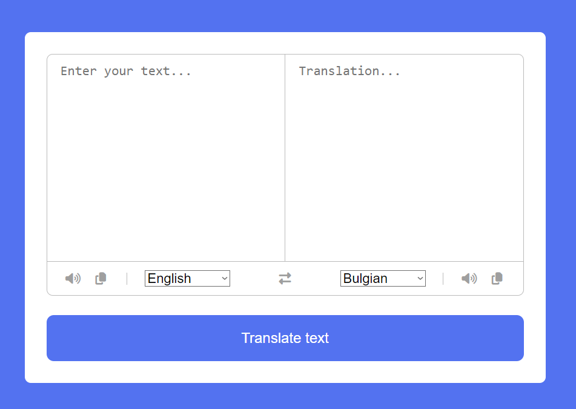
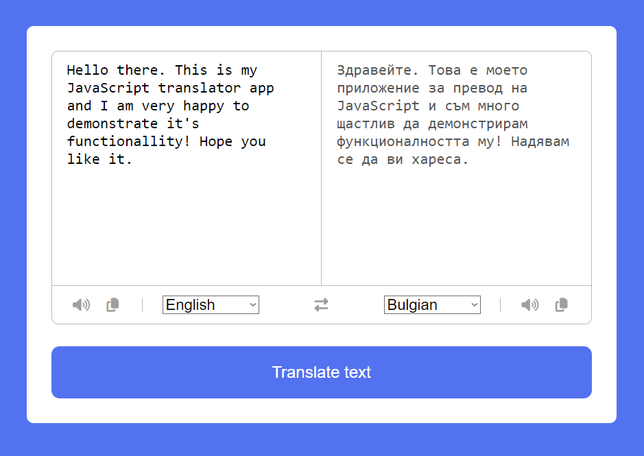

The purpose of this project is to serve as a translator from and to multiple languages that the user can choose by himself. The main functionality is done with JavaScript DOM and API fetch.
This is how the interface of the project looks like:  
    
When the app is launched for the first time, default languages are set so that English is the language to be translated and Bulgarian is the translation. However users can set their own preferences.  
Here is an example of the translator app in action:  
    
In addition, users can also copy the text which they provided, listen to the pronunciation of both the languages and also reverse the translation direction. All of this is done by clicking the following icons under the text fields.  
There are some more specifications which are not so important but on the whole this is the main functionality.  
Enjoy!